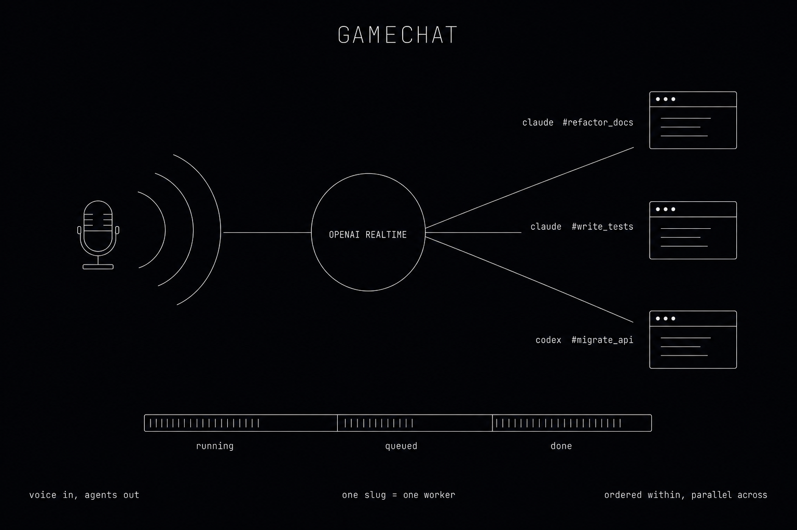

# gamechat



Voice-driven supervisor for [Claude Code] and [Codex]. You talk to a low-latency Realtime model in your terminal; whenever you ask for real work, it dispatches a job to a background coding agent and narrates the result when it lands.

```
🎤 ──▶ OpenAI Realtime (gpt-realtime-2) ──▶ 🔈
                │
                │  tool: delegate_to_orchestrator(slug, intent, …)
                │  tool: sub_agent_progress(slug)
                ▼
        OrchestratorJobManager ◀── unix socket ── gamechat inspect / tail / open
                │  one worker task per slug,                 (other terminal)
                │  ordered within a slug,
                │  concurrent across slugs
                ▼
        ┌───────┴────────┐
   `claude -p`        `codex exec`
   (Claude Code)      (Codex CLI)
```

## Architecture

There is exactly **one realtime voice loop**, an **async worker pool** for background agent jobs, and a tiny **control plane** that exposes job state to other terminals. 

### The voice loop (`src/voice_loop/`)

A single `tokio::select!` loop that owns:

- a microphone stream (`cpal`, mono, resampled to 24 kHz)
- a websocket to the OpenAI Realtime API
- a playback buffer (`cpal` again, jittered)
- a channel of job-completion events from the worker pool

On startup it sends a `session.update` that registers two tools — `delegate_to_orchestrator` and `sub_agent_progress` — and tells the model to use stable snake_case **slugs** for each background task. Reusing a slug continues the same orchestrator conversation; new slugs spawn parallel work. Run `gamechat --print-realtime-config` to inspect the exact JSON.

### The worker pool (`src/orchestrator/`)

`OrchestratorJobManager` runs in its own task. Behind it:

- **One worker per slug.** All sends for `refactor_docs` go through the same `OrchestratorSession`, in order. Different slugs run concurrently in independent sessions.
- **A `ProgressStore`.** Workers stream snippets into a slug-keyed buffer; `sub_agent_progress` queries it with built-in rate limiting (~5 s) so the model can't poll itself into a loop.
- **A `Provider` / `Session` trait** with two backends:
  - **`claude`** — spawns `claude -p` per send. First send uses `--name <slug>`; subsequent sends use `--resume <session_id>`. Claude Code's server-side prompt cache does the heavy lifting; we don't maintain our own.
  - **`codex`** — spawns `codex exec` per send and tails its output back through the same `SendResult` shape.

Adding a third backend means implementing `Provider` and wiring one match arm in `main.rs`. The voice loop doesn't know which agent is on the other end.

### The control plane (`src/control/`)

The realtime process binds a Unix domain socket at startup and serves a tiny JSON-over-newline protocol. A second `gamechat` invocation reconnects to that socket for `inspect`, `tail`, or `open`. The control module never touches the voice loop or the orchestrator internals — it depends only on `Arc<ProgressStore>`, so the live conversation is unaffected by inspection. See **Inspecting active sub-agents** below for the user-facing surface.

## Install

```sh
curl -fsSL https://raw.githubusercontent.com/zdql/gamechat/main/install.sh | sh
```

Pulls the latest prebuilt binary for your platform from [GitHub Releases] and drops it in `~/.local/bin/gamechat`. Supported platforms: `darwin-arm64`, `darwin-x86_64`, `linux-x86_64`, `linux-arm64`. The installer verifies the SHA-256 published with each release before installing; bypass with `GAMECHAT_SKIP_CHECKSUM=1` (not recommended).

The installer also prompts (hidden input) for your `OPENAI_API_KEY` and stores it at `~/.config/gamechat/env` (mode 0600, single-quoted so it round-trips through `source`). `gamechat` reads that file automatically from any working directory, so `gamechat --realtime` just works after install. Skip the prompt with `GAMECHAT_NO_PROMPT=1`. When piped into a noninteractive shell with no key and no existing config, the installer prints a warning with the exact commands to set the key yourself.

If `~/.local/bin` isn't on your `PATH`, the installer prints the line to add to your shell profile. It also checks whether `claude` and `codex` are on `PATH` and warns if the backend you'll need is missing.

**Pin a version or change install location:**

```sh
GAMECHAT_VERSION=v0.1.0 INSTALL_DIR=/usr/local/bin \
  sh -c "$(curl -fsSL https://raw.githubusercontent.com/zdql/gamechat/main/install.sh)"
```

### From source

```sh
git clone https://github.com/zdql/gamechat.git && cd gamechat
cargo install --path .
```

Requires Rust 1.87+. Linux additionally needs `libasound2-dev` (and `pkg-config`) for `cpal`.

## Prerequisites

- **`OPENAI_API_KEY`** — required. The Realtime API runs on OpenAI regardless of which background agent you use.
- **A coding agent on your `$PATH`:**
  - [Claude Code] (`claude`) — default backend.
  - [Codex CLI] (`codex`) — pass `--provider codex`.
- Microphone + speakers.

`gamechat` resolves each env var from the first source that defines it, in this priority order:

1. the process environment (exported in your shell);
2. the **first** `.env` file found by walking up from the current working directory (parents are searched until one is found, then the walk stops);
3. `$XDG_CONFIG_HOME/gamechat/env` (defaults to `~/.config/gamechat/env`) — the file the installer writes.

So a `.env` next to your project overrides the global file, and anything already exported in your shell overrides both. Values may be unquoted, double-quoted, or single-quoted; single-quoted values support the POSIX `'\''` literal-quote escape, which is what the installer emits.

## Usage

```sh
# Live voice session — talks to Claude Code by default. Ctrl-C to stop.
gamechat --realtime

# Use Codex instead.
gamechat --realtime --provider codex --codex-model gpt-5-codex

# One-shot delegation (no audio) — useful for scripting / smoke tests.
gamechat --once "summarize the last 5 commits" --slug summarize_commits

# Dump the session.update JSON without connecting.
gamechat --print-realtime-config

# Drop a personality on top of the orchestrator instructions.
gamechat --realtime --preset jarvis

# From another terminal, while a realtime session is running:
gamechat inspect                    # list every active sub-agent
gamechat tail refactor_docs         # stream that slug's progress
gamechat open refactor_docs         # print `claude --resume <id>` for that slug
```

| Flag | Default | Description |
|------|---------|-------------|
| `--realtime` | — | Live voice loop (mic + speakers). |
| `--once <msg>` | — | Single delegation; prints the `VoiceUpdate` JSON. |
| `--provider <claude\|codex>` | `claude` | Background coding agent. |
| `--model <id>` | `gpt-realtime-2` | Realtime voice model. |
| `--preset <name>` | `default` | Voice/personality preset (see below). |
| `--voice <name>` | preset's | Override voice (`alloy`, `ash`, `ballad`, `cedar`, `coral`, `echo`, `marin`, `sage`, `shimmer`, `verse`). |
| `--settings <path>` | `~/.config/gamechat/settings.json` | Override the settings file. |
| `--slug <slug>` | `default` | Background task slug (used with `--once`). |
| `--claude-bin` / `--claude-model` | autodetect | Override the `claude` binary or its model. |
| `--codex-bin` / `--codex-model` | autodetect | Override the `codex` binary or its model. |

## Voice & personality

Pick a built-in preset on the command line:

```sh
gamechat --realtime --preset jarvis
gamechat --realtime --preset jarvis --voice ash    # keep persona, swap voice
```

Mix and match — `--preset jarvis --voice ash` keeps the butler dialogue on a gravelly voice.

Built-in presets — one zany persona per Realtime voice, plus a bare default and a useful `concise`:

| Name | Voice | Persona |
|------|-------|---------|
| `default` | `marin` | None — bare orchestrator frontend. |
| `jarvis` | `cedar` | Polite British AI butler à la Iron Man. |
| `concise` | `sage` | Extremely terse. No preamble, no filler. |
| `gameshow` | `alloy` | 1970s game show host — lightning round energy. |
| `noir` | `ash` | Hardboiled 1940s film-noir detective. |
| `bard` | `ballad` | Wandering medieval bard who rhymes when natural. |
| `influencer` | `coral` | Overcaffeinated LA wellness influencer. |
| `thespian` | `echo` | Classically trained Shakespearean actor. |
| `monk` | `sage` | Deadpan zen monk — opens with a one-line koan. |
| `diva` | `shimmer` | Broadway diva, perpetually mid-Act II climax. |
| `sportscaster` | `verse` | Live play-by-play announcer narrating the agent. |

For something durable, write `~/.config/gamechat/settings.json`:

```json
{
  "preset": "jarvis",
  "voice": "cedar",
  "presets": {
    "coach": {
      "voice": "verse",
      "persona": "You are an energetic coach. Be encouraging and direct. Celebrate small wins."
    }
  }
}
```

Resolution order, highest to lowest: CLI flag → top-level `voice` / `persona` in settings → preset's value → built-in default. Custom presets override built-ins of the same name. The orchestrator-delegation instructions are always sent — personas are appended to that base, never replace it. Run `gamechat --preset jarvis --print-realtime-config` to see the exact `instructions` and `voice` that will be sent.

## Inspecting active sub-agents

While a `gamechat --realtime` session is running, open another terminal and ask it what's going on:

```sh
gamechat inspect                       # list every active sub-agent + status
gamechat tail refactor_docs            # stream that slug's progress buffer
gamechat open refactor_docs            # print `claude --resume <session_id>`
gamechat open refactor_docs --launch   # macOS: pop a new Terminal window into Claude Code
```

| Subcommand | Purpose |
|------------|---------|
| `inspect` | Table view of every registered slug: provider, status, elapsed seconds, last message. |
| `tail <slug>` | Polls the progress buffer at ~750 ms and prints any new entries until the job finishes. |
| `open <slug>` | Prints `claude --resume <session_id>` for that slug. With `--launch` on macOS, pops the command into a fresh Terminal window via `osascript`. |

Each subcommand accepts `--pid <PID>` or `--socket <PATH>` if multiple gamechat instances are running. `open` only works against the `claude` provider — codex has no documented resume flag, so `open <codex-slug>` errors out and points you at `tail` instead.

Under the hood, the realtime process binds a Unix domain socket at `$TMPDIR/gamechat-$USER/$pid.sock` (or `$XDG_RUNTIME_DIR` on Linux) and serves a tiny JSON-over-newline protocol (one request per connection). The socket is auto-removed when gamechat exits cleanly; stale entries from crashes are GC'd on the next `inspect` based on `kill(pid, 0)` probes. All of this lives in `src/control/` — entirely separate from the voice loop and orchestrator, depending only on a read-only handle to `ProgressStore`.

## Repository layout

```
gamechat/
├── src/
│   ├── main.rs              # CLI, dotenv, provider wiring
│   ├── types.rs             # DelegateToOrchestratorArgs, VoiceUpdate
│   ├── voice_loop/
│   │   ├── mod.rs           # The select! loop
│   │   ├── session.rs       # session.update JSON + tool defs
│   │   ├── settings.rs      # voice/persona presets, settings.json loader
│   │   └── audio.rs         # cpal input/output, resampling
│   ├── control/             # `inspect`/`tail`/`open` — isolated control plane
│   │   ├── mod.rs           # subcommand routing
│   │   ├── protocol.rs      # JSON-over-UDS wire types
│   │   ├── runtime_dir.rs   # socket directory discovery
│   │   ├── server.rs        # in-process Unix socket listener
│   │   └── client.rs        # subcommand implementations
│   └── orchestrator/
│       ├── interface.rs     # Provider / Session traits, public types
│       ├── jobs.rs          # OrchestratorJobManager + per-slug workers
│       ├── progress.rs      # ProgressStore + rate-limited snapshots
│       ├── bridge.rs        # Realtime tool calls ↔ job events
│       ├── shared.rs        # Logging / stream helpers
│       ├── claude/          # `claude -p` backend
│       └── openai/          # `codex exec` backend
├── install.sh               # curl|sh installer
└── .github/workflows/release.yml  # cross-platform release builds
```

## License

MIT.

[Claude Code]: https://github.com/anthropics/claude-code
[Codex]: https://github.com/openai/codex
[Codex CLI]: https://github.com/openai/codex
[GitHub Releases]: https://github.com/zdql/gamechat/releases
